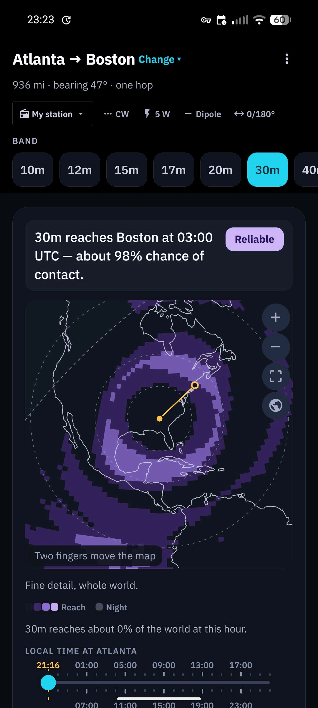
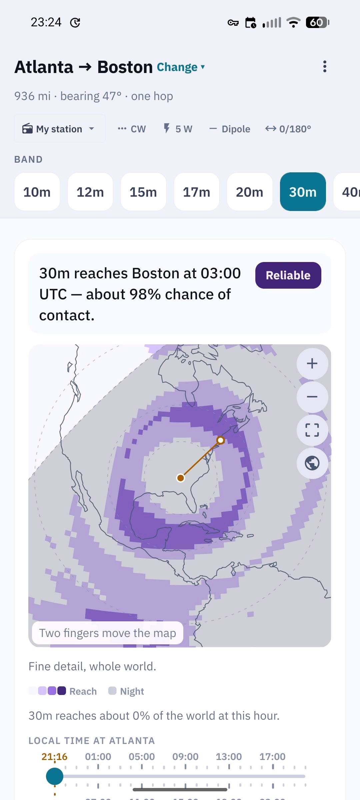
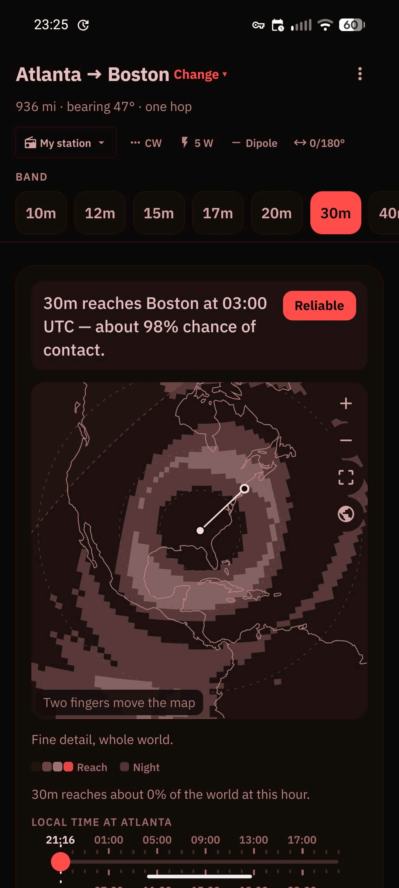
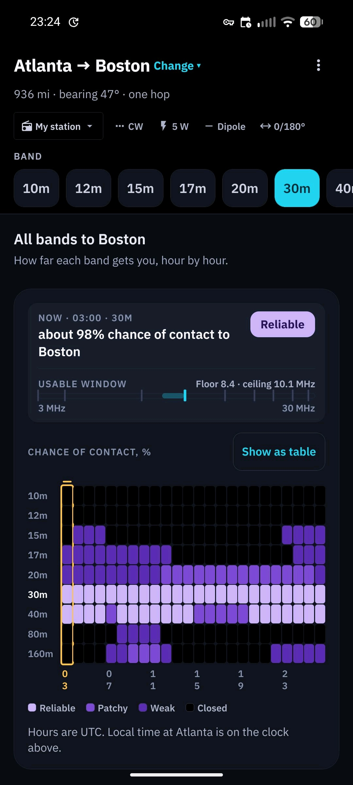
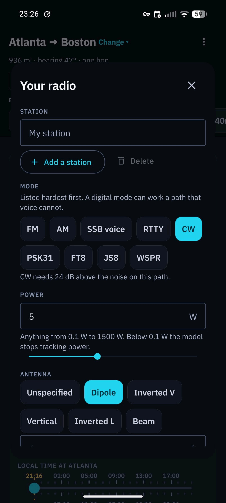
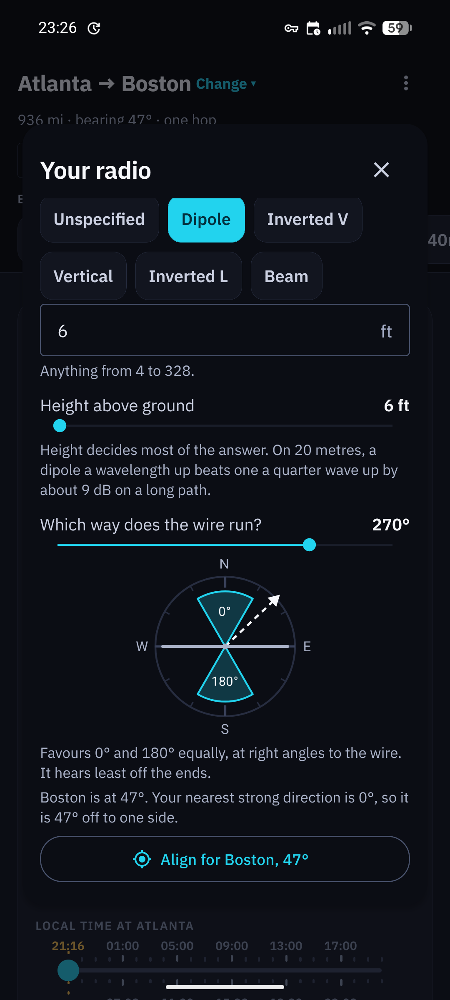

  

<h1 align="center">HFcast</h1>

<h3 align="center">HFcast is a privacy-first offline-friendly HF propagation forecasting app for amateur radio operators. Absolutely free, no ads, no tracking of any kind.</h3>

  
  

<strong>Pick a place, pick a band, enter your radio settings and get a custom forecast for HF propagation.</strong>

  
  
  

  
  
  

  
  
  
  

## What the forecast is

HFcast runs two propagation models, both run locally on your device. Both are built
on the physics behind VOACAP, the point-to-point model NTIA/ITS has maintained
for decades, [translated faithfully to Rust](https://github.com/jonathanmcsweet/hfcast-engine).

**Truecast**, the default, is HFcast's own model. It works from what the ionosphere is doing on a day to day basis, using a daily sunspot figure derived from ionosonde stations, a table of magnetic storms, and an estimate of the height a signal bounces from. Scored day by day against ionosonde measurements since 2015, it was closer than VOACAP on 77% of days, and its average miss was about a fifth smaller.

**VOACAP** is the classic model, reproduced faithfully down to a few defects in
the original, and available in Preferences for anyone who wants to use this traditional reference model. It reports a monthly average, so 4pm on a Tuesday in August will look the same as a 4pm this Thursday in August.

Both models work with no network. Online, Truecast takes a live effective sunspot
index and VOACAP takes the current sunspot number; offline, Truecast falls back
to a built-in correction for the time of year that still beats the monthly
average.

[See HFcast engine for more information](https://github.com/jonathanmcsweet/hfcast-engine)

## Privacy

When online, two features do reach out to the network with no identifying data of yours being sent out:

- Today's space weather (from NOAA)
- Recent ionosphere measurements (from GIRO)

Everything else:

- Runs on a de-Googled phone or your old tablet without any Google services
- Developed and tested on GrapheneOS
- Works fully offline by calculating conditions based on historical HF propagation records
- Nothing about your station, your position, or the path you're checking leaves the device
- No ads
- No account
- No sign-in
- No tracking
- No data collection
- No phoning home
- No annoying registration
- No mandatory tutorials
- No noisy email spam
- No push notifications
- No crapware
- No spyware

## Build it

Start with the [quick start](docs/development.md#quick-start) — about
15 minutes on a machine that already has the toolchain — then the rest
of the [development guide](docs/development.md) if you're going to work
on the code.

## What's in this repository

| Part               | What it is                                         |
| ------------------ | -------------------------------------------------- |
| [mobile/](mobile/) | The application, for Android and the web           |
| [server/](server/) | The prediction API, for builds that have no engine |
| [docs/](docs/)     | The guides                                         |

The propagation engine itself lives in a separate repository,
[hfcast-engine](https://github.com/jonathanmcsweet/hfcast-engine); a
Rust translation of VOACAP, tested cell by cell against the original
Fortran.

## Built on the work of

Almost everything HFcast knows comes from other people's work. The same
list, with links and full licence text, is in the app's About screen.

| What                                                                                                                            | Whose                                            | Terms                                                             |
| ------------------------------------------------------------------------------------------------------------------------------- | ------------------------------------------------ | ----------------------------------------------------------------- |
| [VOACAP](https://its.ntia.gov/), the propagation model                                                                          | NTIA/ITS, maintained by Greg Hand                | US Government work, not subject to copyright protection in the US |
| [voacapl](https://github.com/jawatson/voacapl), the Unix port this engine was translated from                                   | J.A. Watson                                      | [CC0](https://creativecommons.org/publicdomain/zero/1.0/)         |
| [The ionospheric coefficient maps](https://github.com/ITU-R-Study-Group-3/ITU-R-HF)                                             | CCIR Reports 322 and 340, published by ITU-R     | published for implementers free from copyright assertions         |
| The place list searched offline                                                                                                 | NTIA/ITS, from the VOACAP distribution           | US Government work                                                |
| [Coastlines and country borders](https://www.naturalearthdata.com/)                                                             | Natural Earth                                    | public domain                                                     |
| [Sunspot numbers and solar indices](https://www.swpc.noaa.gov/)                                                                 | NOAA Space Weather Prediction Center             | US Government work                                                |
| [Measured ionosonde soundings](https://giro.uml.edu/)                                                                           | UMass Lowell Global Ionosphere Radio Observatory | used with attribution                                             |
| [Place search, when online](https://open-meteo.com/)                                                                            | Open-Meteo                                       | [CC BY 4.0](https://creativecommons.org/licenses/by/4.0/)         |
| [The aurora on the launch screen](https://commons.wikimedia.org/wiki/File:ISS-42_Aurora_borealis_over_North_Atlantic_Ocean.jpg) | NASA / Samantha Cristoforetti, ESA               | public domain                                                     |
| [IBM Plex Sans](https://github.com/IBM/plex), the typeface                                                                      | IBM                                              | SIL Open Font License 1.1                                         |

Three of those are live services the app calls directly, with no key:
NOAA and GIRO, at most once every 15 minutes each, and Open-Meteo, only
when a searched place isn't in the built-in list.

The Institute for Telecommunication Sciences, NTIA, US Department of
Commerce, developed VOACAP. NTIA/ITS and NOAA do not endorse HFcast and
are not responsible for what it reports.

## Licence

Apache-2.0. See [LICENSE](LICENSE) and [NOTICE](NOTICE).
